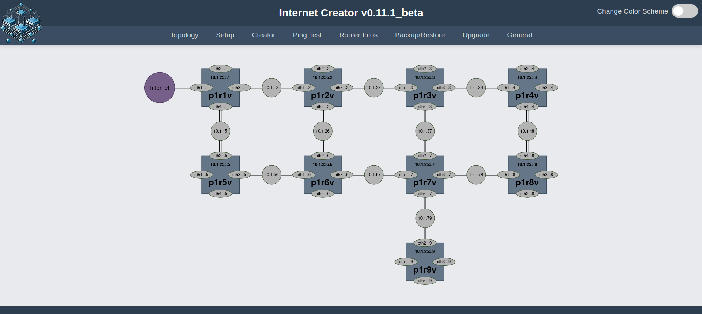
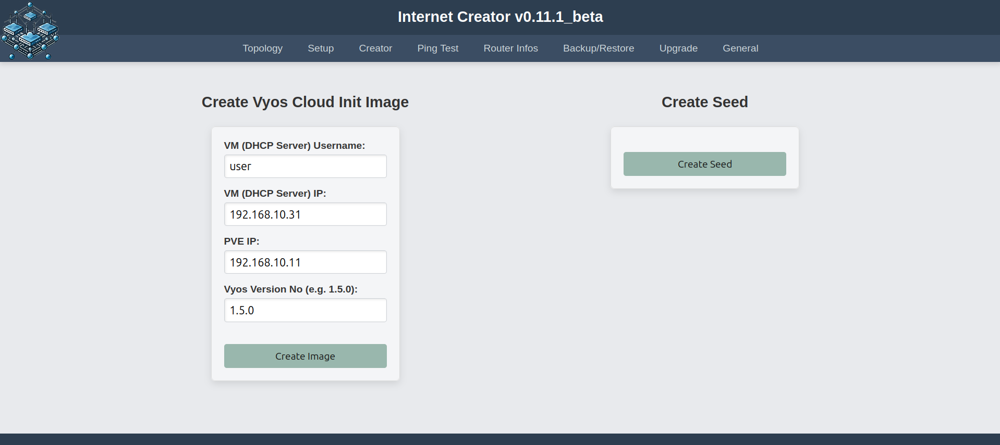
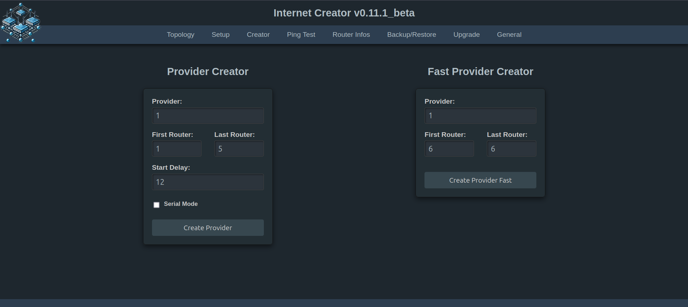

## **ACHTUNG: Der Internet Creator funktioniert nicht mehr richtig, wenn man das neue ubuntu-24.04.2-live-server-amd64 als DHCP-Sever nimmt. Man sollte ubuntu-24.04.1-live-server-amd64 verwenden.** ##

## Verwendungszwecke:

Es geht hier darum, drei Netzwerke (ISP's) bestehend aus jeweils 9 Vyos-Routern automatisiert unter PVE aufzusetzen und mit Ansible zu konfigurieren. Der Internet Creator steuert eine abgewandelte Version von [aibix0001 (Gerd's) provider.sh](https://github.com/aibix0001/aasil), die darauf ausgelegt ist, sich bzgl. der Arbeitsgeschwindigkeit an die Gegebenheiten verschieden starker CPU's anzupassen: So gibt es einen Fast Modus für Rechner mit besonders starken CPU's, einen Normalmodus für schwächere CPU's und einen seriellen Modus für besonders schwache CPU's. Um den passenden Modus für die jeweils verwendete CPU zu finden, siehe den Abschnitt 'Erfahrungswerte' im 'Beschreibung und Gebrauchshinweise zum INC v0.11.1_beta.md'.
Das [Aibix-Projekt](https://www.twitch.tv/aibix0001) wendet sich u.a. an Auszubildende und Studenten im IT-Bereich, sowie weitere Interessierte, die nicht unbedingt immer drei Kraftpakete zur Verfügung haben. Der Internet Creator ist deshalb insbesondere auch zur Verwendung mit schwächeren Rechnern entwickelt worden.

## Neueinsteiger

Für alle, die mit den [Streams](https://github.com/aibix0001/streams) von Aibix nicht von Anfang an vertraut sind, gibt es anstatt des Quickstarts das 'Setup INC v0.11.1_beta.md', in dem der Aufbau des speziellen PVE-Setup's im Einzelnen beschrieben wird, innerhalb dessen der 'inc'-Ordner mit dem Internet Creator läuft.

## Quickstart

Nach dem Clonen dieses Repos den Ordner inc aus dem Ordner internet_creator_v0.11 herausnehmen und in den Pfad ```/home/user/``` des PVE-Hosts ablegen und dann von da aus arbeiten.

Zunächst das Skript ```useradd.sh``` (als pve-root) laufen lassen. Das erleichtert nicht nur den SSH-Login erheblich (vgl. Beschreibung und Gebrauchshinweise zum INC v0.11.md Anmerkung (4)), sondern ist auch Voraussetzung dafür, dass das Skript ```dhcp_configure.sh``` funktioniert. 
Die automatische Erstellung des Vyos Cloud Init Images findet auf dem DHCP-Server statt. Das funktioniert nur, wenn der Server in der Weise aufgesetzt worden ist, die im Setup.md beschrieben wird. Konkret bedeutet das, dass die SSH-Schlüssel zwischen dem PVE-User und dem DHCP-Server-User ausgetauscht werden und das Skript ```dhcp_configure.sh``` ausgeführt wird. 

Der Internet Creator wird folgendermaßen aufgerufen:
```bash
source .venv/bin/activate
cd inc
./inc.sh
```
Oder ```./go.sh``` unter ```/home/user/``` ausführen - noch einfacher mit ```alias go='./go.sh'``` in der ```.bashrc```

Nötigenfalls sudo-Password des Users im Terminal eingeben.





Nicht zusammen mit Dark Reader verwenden!

## Neue Features des INC v0.11.1_beta

1. Der HTML-Code ist durch Verwendung von Jinja-Template Vererbung erheblich verkürzt worden.
2. Bei den Setup-Skripten für die pfSense und den DHCP-Server muss nun nicht mehr zwischen ZFS und Btrfs gewählt werden, sondern es gibt jeweils ein einziges Skript, das automatisch erkennt, um welches Dateisystem es sich handelt.
3. Im Normalmodus sind kleine Pausen zwischen den Konfigurationstasks eingefügt worden, sodass es nun auch in der Konfigurationsphase einen Unterschied zum Fast Mode gibt.
4. Sämtliche Timeoutprobleme sind behoben.
5. Die Dokumentation ist von PDF auf Markdown umgestellt worden.

## Spezielle Probleme der Version v0.11.1_beta

Statt auf einem Development-Server läuft die Web App auf einem professionellen Gunicorn Server. Obwohl das Frontend weitestgehend unauffällig läuft, gibt es im Backend regelmäßig Fehlermeldungen, die bislang nicht abgestellt werden konnten. Diese Fehlermeldungen treten aber nur im Zusammenhang mit der Verwendung des flask-socketio beim Ping-Test und der Anzeige von Routerinformationen auf und sind offenbar darauf zurückzuführen, dass sich der Gunicorn-Server bzw. das Eventlet-Modul mit dem socketio nicht ganz verträgt. Zu Einzelheiten siehe 'Spezielle Probleme des INC on Gunicorn.md'.

Achtung: Sobald man ```pip install gunicorn eventlet``` in der ```.venv``` ausgeführt hat, wird der Ping Test und die Ausgabe der Router Infos unter Version v0.11 in dieser ```.venv``` nicht mehr funktionieren. Man braucht dann vorher:
```bash
pip uninstall gunicorn eventlet
```
## Troubleshooting

Wenn bei der Ausführung irgendeiner Funktion Fehler auftreten, hilft es in der Regel, einen anderen Mode zu wählen und/oder weniger Router in einem Durchgang zu erstellen.

Sollte mal der (seltene) Fall eintreten, dass obwohl alles korrekt aussieht - die Configs der Router sind ok, es gibt ein DHCP-Lease von der pfSense und die VLAN-Tags des LAN Netzes stimmen auch (also 1011, 2011 bzw. 3011) - es aber trotzdem nicht möglich ist, raus zu pingen, dann alle Router restarten. Wenn es dann immer noch nicht geht, mit anderem (meistens höherem) Delay-Wert oder ggf. im Fast Modus nochmal neu erzeugen.
