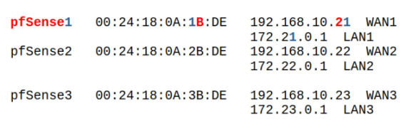
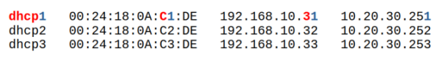

# Setup INC v0.11.1_beta

## **STEUERUNGSRECHNER:**

Es handelt sich im folgenden um ein Beispielsetup. Die Verteilung der IPs und MACs ist natürlich veränderbar.

```bash
echo "Host r1
  HostName 192.168.10.11
  User root

Host u1
  HostName 192.168.10.11
  User user

Host dhcp1
  HostName 192.168.10.31
  User user

Host r2
  HostName 192.168.10.12
  User root

Host u2
  HostName 192.168.10.12
  User user

Host dhcp2
  HostName 192.168.10.32
  User user

Host r3
  HostName 192.168.10.13
  User root

Host u3
HostName 192.168.10.13
User user

Host dhcp3
  HostName 192.168.10.33
  User user" > /home/<tchangalo>/.ssh/config
```
```bash
echo "alias ipbc='ip -br -c a'
alias r1='ssh r1'
alias u1='ssh u1'
alias dhcp1='ssh dhcp1'
alias r2='ssh r2'
alias u2='ssh u2'
alias dhcp2='ssh dhcp2'
alias r3='ssh r3'
alias u3='ssh u3'
alias dhcp3='ssh dhcp3'" >> /home/<tchangalo>/.bashrc
```
Aktivieren mit: 
```bash
. ~/.bashrc
```

## **PVE INSTALLIEREN**

Updaten

SSH-Key des Steuerungsrechners unter ```/home/root/.ssh/authorized_keys``` abspeichern.
```bash
ssh-copy-id -i ~/.ssh/id_ed25519 root@rX
```
```bash
cd /root/.ssh
ssh-keygen -t ed25519 #[ OHNE PASSPHRASE! ]
```
```bash
apt install -y sudo mc bpytop htop termshark lnav python3 python3.11 python3-pip python3.11-venv python3-venv jq
```

ubuntu-live-server.iso und pfSense.iso hochladen.

vmbr1001 MGMT erstellen. Die IP von vmbr1001 ist 10.20.30.254/24

Später werden folgende weitere IPs im MGMT-Netz vergeben:
```
dhcp1 10.20.30.251
dhcp2 10.20.30.252
dhcp3 10.20.30.253
```

## **SKRIPTE KOPIEREN**

Für X die Knoten-Nr. einsetzen.

**Steuerungsrechner:**
```
scp useradd.sh rX:
```
```bash
scp pfsenseX.sh pfsX_postinstall.sh rX:
```
```bash
scp dhcpX.sh dhcpX_postinstall.sh rX:
```

## **USER UND .VENV ANLEGEN**

**pve-root**: 
```bash
./useradd.sh
```

**Steuerungsrechner**: 
```bash
ssh-copy-id -i ~/.ssh/id_ed25519 user@uX
```

## **TEILAUTOMATISIERTES SETUP**

Wer die folgenden Schritte des Aufsetzens der pfSense und des DHCP-Server bereits einmal gemacht hat und Backups dieser Maschinen gemacht hat, kann diese Backups nun einfach restoren. Die Backups sollten natürlich nicht uralt sein.

Beim _**Restore der pfSense**_ ist auf folgendes zu achten: Man sollte kontrollieren, ob die gewünschten IPs und MAC vorhanden sind (siehe Beispielsetup unten). Ansonsten diese anpassen. Außerdem 'Unique' bei Restoren anhaken. Weiterhin ist darauf zu achten, dass alle Bridges vorhanden sind, die auch auf dem Rechner vorhanden waren, auf dem das Backup erstellt wurde. Für jedes Interface der pfSense muss diejenige Bridge verfügbar sein, die ihm hardwaremäßig zugewiesen ist. Alternativ können diese Zuweisungen natürlich auch angepasst werden.

Beim _**Backup des DHCP-Servers**_ ist zu beachten, das es gemacht werden muss, bevor das Skript ```dhcp_configure.sh``` ausgeführt wird. Nähere Hinweise dazu finden sich unten an derjenigen Stelle, wo das Backup nach dem (erstmaligen) händischen Aufsetzen des DHCP-Servers zu erstellen ist.

## **PFSENSE INSTALLIEREN**

2 CPUs, 1536 MB RAM , 8 GB Festplatte

**pve-root**: 
```bash
./pfsenseX.sh
```

pfSense starten und installieren. Statt Auto (ZFS) nehmen wir Auto (UFS) und dann GPT statt MBR.

Swap rauslöschen, um SSD nicht kaputt zu machen!

Am Ende nicht 'Reboot' wählen, sondern 'Shell' und dann poweroff eingeben.

**pve-root**: 
```bash
./pfsX_postinstall.sh
```

Falls möglich vor dem ersten Start über die MAC Adresse (z.B. unter Network Device -> MAC Address) im Router eine feste IP für die pfSense definieren: Z.B. 192.168.10.21 für pfSense1, 192.168.10.22 für pfSense2 und 192.168.10.23 für pfSense3.

Default Login: 
```
user: admin 
password: pfsense
```

Unter ```System / Advanced / Networking``` 'Kea DHCP' auswählen.

Unter den WAN Firewall Regeln die Anti-Lockout Regel replizieren mit 
```
Protocol: any
Destination: WAN address
```

pfSense runterfahren.

Unter PVE die vlan-sensiblen Anschlüsse vmbr1, vmbr2 und/oder vmbr3 – ohne irgendwelche IPs – anlegen.

**Beispielsetup:**



Der pfSense einen neuen Network Device auf der vmbr1 mit VLAN-Tag 1011 hinzufügen. Dabei VirtIO (paravirtualised) auswählen und den Haken von Firewall wegnehmen. Das ist das LAN1. Nach dem Hochfahren der pfSense dieses Device mit der IP 172.21.0.1/24 konfigurieren. Die DHCP-Server Range muss nicht besonders groß sein, z.B. 172.21.0.10 bis 172.21.0.20 . Vor dem Hochfahren ggf. (je nach dem, ob man nur einen oder alle drei Provider auf dem PVE aufsetzen möchte) noch zusätzlich vmbr2 und vmbr3 anlegen und dabei ebenfalls VirtIO (paravirtualised) auswählen und den Haken von Firewall wegnehmen.

vmbr2 wird in der pfSense als LAN2 konfiguriert und bekommt die IP 172.22.0.1/24 und den VLAN-Tag 2011. vmbr3 wird in der pfSense als LAN3 konfiguriert und bekommt die IP 172.23.0.1/24 und den VLAN-Tag 3011.

Bei LAN2 und LAN3 auf EINEM Node (Standalone-Setup) die ```Default allow LAN2(3) to any rule``` anlegen:
```
Protocol: any
Source: LAN2(3) subnets
Destination: any
```

## **UBUNTU DHCP-SERVER AUFSETZEN**

1536 MB RAM, 4 Cores (host) und 8 GB Festplatte

Sofern man im Standalone-Setup arbeitet, reicht es, nur dhcp1 aufzusetzen, der dann die IPs für die Router von ISP2 und ISP3 mitvergibt. (In diesem Fall braucht man natürlich auch nur die pfSense1 mit vmbr1, vmbr2 und vmbr3.)

**pve-root**: 
```bash
./dhcpX.sh
```

Vor dem Starten über die MAC im Router eine feste IP 192.168.10.31\[2,3] für den DHCP-Server definieren bzw. falls das nicht geht, nach der Installation.

**Beispielsetup:**



Dem MGMT-Interface net1 während der Installation manuell die IP 10.20.30.251\[2,3]/24 für node1\[2,3] zuweisen.

Im Beispielsetup während der Installation als Usernamen ```user``` und den Hostnamen ```dhcpX``` wählen. Diese Bezeichnungen sind zwar grundsätzlich frei wählbar, erfordern dann aber ggf. entsprechende Anpassungen in den ```.ssh/config``` und ```.bashrc``` .

Nach dem Installieren: Kein reboot, kein shutdown, sondern stop und dann: ```./dhcpX_postinstall.sh```

**user@dhcpX**:
```bash
sudo apt-get update && sudo apt upgrade -y
```
```bash
sudo apt install mc termshark kea lnav -y && sudo reboot
```

**Backup erstellen:** Hier ist die Stelle an der nach dem händischen Aufsetzen des DHCP-Severs ein Backup gemacht werden kann. (Man könnte auch erst nach Ausführung des ```dhcp_configure.sh``` ein Backup machen, dann würde man aber auch die SSH-Keys übernehmen.)

**Steuerungsrechner:** 
```bash
ssh-copy-id -i ~/.ssh/id\_ed25519 user@dhcpX
```
```bash
scp dhcp_configure.sh dhcpX:
```

**user@dhcpX**:
```bash
./dhcp_configure.sh
```

Zu Beginn des Skriptablaufs werden folgende Eingaben abgefragt:

1\) Das Passwort des DHCP-Server Users

2\) Die IPv4 des PVE-Hosts \[z.B. 192.168.10.11]

3\) Das Passwort des PVE-Users

4\) _Nochmal_ das \[sudo] Passwort des DHCP-Server Users

Und am Ende des Skripts ist _nochmal_ einzugeben:

5\) Das Passwort des PVE-Users

Bei der Installation des Kea-Servers werden drei Optionen bzgl. Passwortsetzung für den Server gegeben. Welche man wählt ist für die Funktionalität der Internet Creators irrelevant.

Schließlich als **PVE-User**: 
```bash
ssh-copy-id -i ~/.ssh/id_ed25519 user@dhcpX
```

Falls wenig RAM vorhanden: Ausschalten und RAM auf 1024 MB runtersetzen.

## **VYOS CLOUD INIT IMAGE UND SEED.ISO ERSTELLEN**
```bash
https://docs.vyos.io/en/latest/automation/cloud-init.html
```

Den _Internet Creator_ in Betrieb nehmen und dort unter Setup beide Schritte automatisiert ausführen. Das funktioniert allerdings nur, wenn (wie oben beschrieben)

(1) die Skripte ```useradd.sh``` auf dem PVE und ```dhcp\_configure.sh``` auf dem DHCP-Server ausgeführt worden sind und

(2) der PVE-User und der DHCP-Server User gegenseitig ihre SSH-Schlüssel getauscht haben.

## **INTERNET CREATOR STARTEN**

Nach dem Clonen dieses Repos den Ordner inc aus dem Ordner **internet\_creator\_\<latest>** herausnehmen und in den Pfad ```/home/user/``` des PVE-Hosts ablegen und dann von da aus arbeiten.

Der Ordner ansible darf nicht world-writable sein, also z.B. 770.

Die Datei ```generate_secret_key.py``` in VSCode ausführen (Python Extension installieren, wenn nicht schon vorhanden) und den Secret Key in Zeile 13 von inc.py einfügen, z.B:
```bash
13 app.secret\_key = '\x0c\xf6\xb0\x00\x80%\xf0\xaf\x13\xec\xe0\xc6R\x90\xeeh\xb1\xfe\x95\x93\x92\x7f\xaa\xa3'
```

Und dann eingeben:
```bash
source .venv/bin/activate
cd inc
./inc.sh
```

Oder ```./go.sh``` unter ```/home/user/``` ausführen - noch einfacher mit ```alias go='./go.sh'``` in der .bashrc

Jetzt kann der Internet Creator im Browser aufgerufen werden unter:  ```<ip-pve>:32100```

Bei der Erstellung des Vyos Cloud Init Image muss im Terminal ggf. das sudo-Password des PVE-Users eingegeben werden, bevor das Skript durchläuft.
